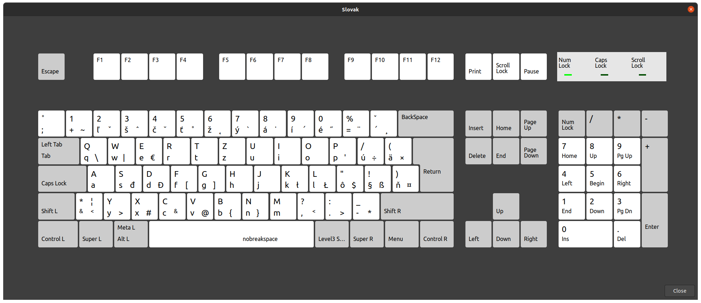

# Slovak keyboard layout for X.org

Default slovakian keyboard layout in X.org is different from the one in Windows. This is very frustrating for a user who is using slovakian keyboard and wants to switch from Windows to Ubuntu or any other distro using X.org.

Some keys with `AltGr` are different, e.g.
- `AltGr+P` does not produce Apostroph.
- `AltGr` + `AE11` does not produce `dead_diaeresis`.
- etc...

Layout is based on http://kbdlayout.info/KBDSL/, see following picture:



## Quick installation

Copy new layout to xkb symbols folder.

```bash
sudo wget -O /usr/share/X11/xkb/symbols/sk https://raw.githubusercontent.com/m1k1o/xkb-slovak-layout/master/sk
```

Apply new layout.

```bash
setxkbmap sk
```

## Alternative installation

Or you can just apply patch.

```bash
wget -O /tmp/sk https://raw.githubusercontent.com/m1k1o/xkb-slovak-layout/master/sk
sudo patch /usr/share/X11/xkb/symbols/sk < /tmp/sk
```
